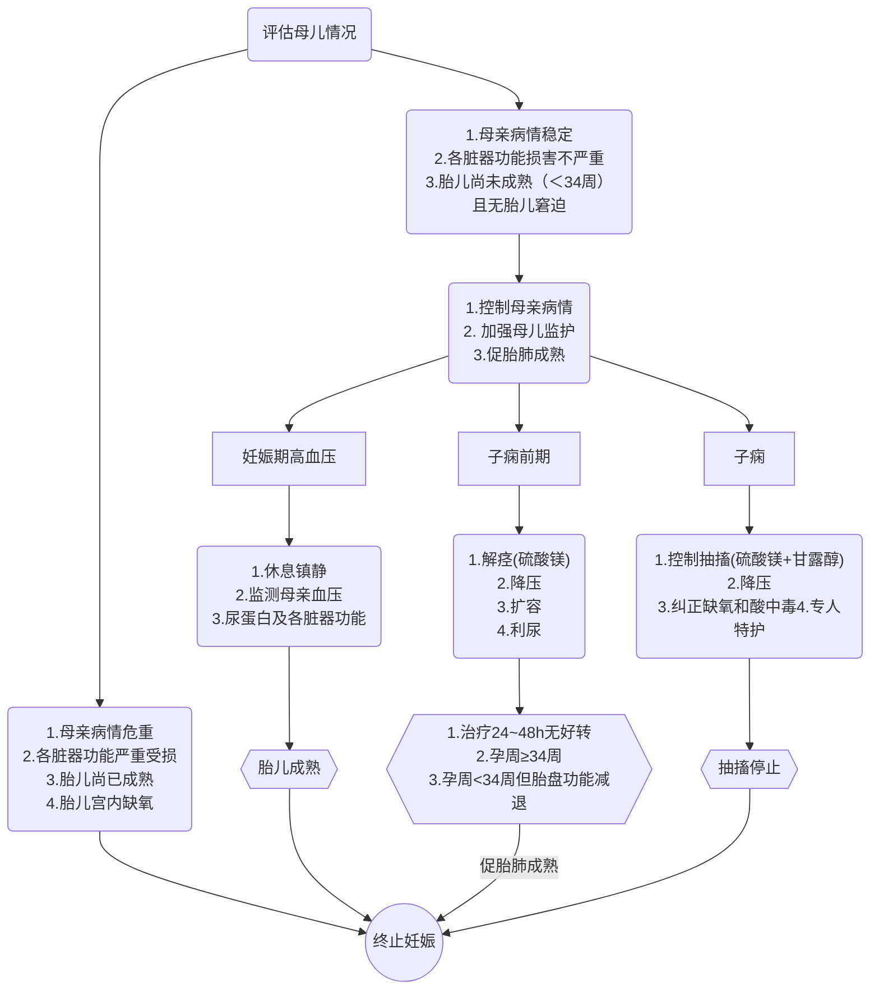

```mermaid 
flowchart TD
A1(评估母儿情况)

A1-->B1("1.母亲病情稳定\n2.各脏器功能损害不严重\n3.胎儿尚未成熟（＜34周）且无胎儿窘迫")
A1-->B2("1.母亲病情危重\n2.各脏器功能严重受损\n3.胎儿尚已成熟\n4.胎儿宫内缺氧")

B2-->C1((终止妊娠))
B1-->C2("1.控制母亲病情\n2. 加强母儿监护\n3.促胎肺成熟")

C2-->妊娠期高血压-->D1("1.休息镇静\n2.监测母亲血压\n3.尿蛋白及各脏器功能")-->E1{{胎儿成熟}}-->C1
C2-->子痫前期-->D2("1.解痉(硫酸镁)\n2.降压\n3.扩容\n4.利尿")-->E2{{"1.治疗24~48h无好转\n2.孕周≥34周\n3.孕周<34周但胎盘功能减退"}}--促胎肺成熟-->C1
C2-->子痫-->D3("1.控制抽搐(硫酸镁+甘露醇)\n2.降压\n3.纠正缺氧和酸中毒4.专人特护")-->E3{{抽搐停止}}-->C1
```
